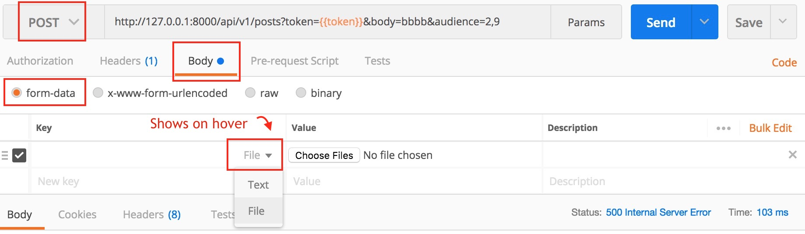

Akka HTTP csv-upload
---

* https://github.com/bassmake/akka-http-csv-upload

* https://stackoverflow.com/questions/16015548/tool-for-sending-multipart-form-data-request
* `www.sample-videos.com` [https://www.sample-videos.com/csv](https://www.sample-videos.com/csv) https://www.sample-videos.com/csv/Sample-Spreadsheet-10-rows.csv


1. `http://localhost:8080/hello`  GET
    ```text
    Say hello to akka-http
    ```



2. `http://localhost:8080/csv-upload`  POST
    from-data: `File = sample-10-rows.csv`
    200
